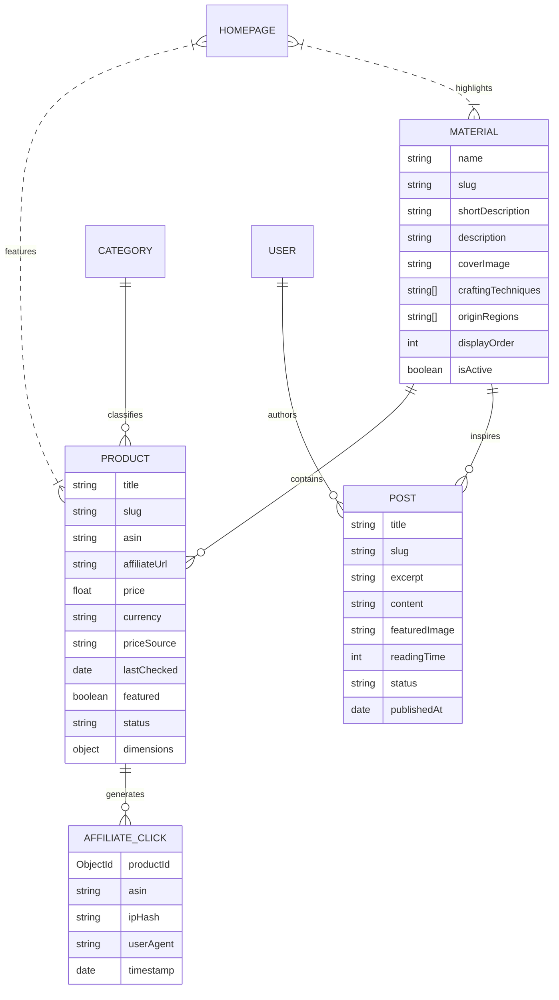

# VietCraft - Architecture & System Design Document

## 1. Executive Overview

VietCraft is a production-ready, full-stack MERN (MongoDB, Express, React, Node.js) web platform designed for natural home decor editorial storytelling and Amazon affiliate discovery targeting US consumers. The platform celebrates authentic Vietnamese artisanal traditions across six natural mediums:

1. **Rattan & Bamboo** (Phú Vinh craft village, Hanoi)
2. **Ceramics** (Bát Tràng & Phù Lãng kilns)
3. **Lacquer** (Hạ Thái lacquer guild)
4. **Wood** (Đồng Kỵ & Kim Bồng woodworkers)
5. **Woven Fibers** (Kim Sơn seagrass & Mekong water hyacinth)
6. **Silk** (Mã Châu & Vạn Phúc handlooms)

---

## 2. Monorepo Structure

VietCraft is structured using npm workspaces:

```
vietcraft/
├── apps/
│   ├── api/          # Express + TypeScript + Mongoose REST API (Port 5000)
│   ├── web/          # Public Storefront (React + Vite + Tailwind, Port 5173)
│   └── admin/        # Admin CMS Dashboard (React + Vite + Tailwind, Port 5174)
├── packages/
│   ├── shared/       # Universal TypeScript models, Zod validation, shared constants
│   └── config/       # Shared TypeScript presets and Tailwind design systems
├── docs/             # Technical architecture, API reference, deployment guides
├── docker-compose.yml
├── .env.example
└── README.md
```

---

## 3. Data Architecture & Entity Relationship



---

## 4. Amazon Affiliate & FTC Compliance Engine

1. **Amazon Associates Operating Agreement**:
   - Outbound links use standard Amazon Standard Identification Numbers (ASIN) and dynamically construct affiliate tags (`tag=vietcraft-20`).
   - Every outbound link includes `rel="nofollow sponsored noopener noreferrer"`.
2. **FTC 16 CFR Part 255 Transparency**:
   - Short disclosure displayed on every product card.
   - Comprehensive legal disclosure rendered on `/affiliate-disclosure` and in site footer.
   - Exact timestamps on product pricing to communicate that Amazon prices may change rapidly.
3. **`AmazonProductService` Abstraction**:
   - Decoupled service layer in `apps/api/src/services/AmazonProductService.ts`.
   - Encapsulates ASIN validation, affiliate URL generation, click logging, and readiness for official Amazon Product Advertising API (PA-API 5.0) integration.

---

## 5. Security & Authorization Matrix

| Role | Public Routes | Post Management | Product Management | Material/Category | Homepage CMS | Settings |
|---|---|---|---|---|---|---|
| **Public Visitor** | Read-only | Published only | Active only | Active only | Published only | Read-only |
| **Editor** | Read-only | CRUD (All) | CRUD (All) | CRUD | Update | Read-only |
| **Admin** | Read-only | CRUD (All) | CRUD (All) | CRUD | Update | Full Access |

- Passwords hashed using `bcrypt` (10 rounds).
- Short-lived JWT Access Tokens (1 hour) + HTTP-only Refresh Tokens (7 days).
- Express rate limiting enabled on `/api/auth/login`.
- Input validation enforced at both client and API gateway via Zod schemas.
